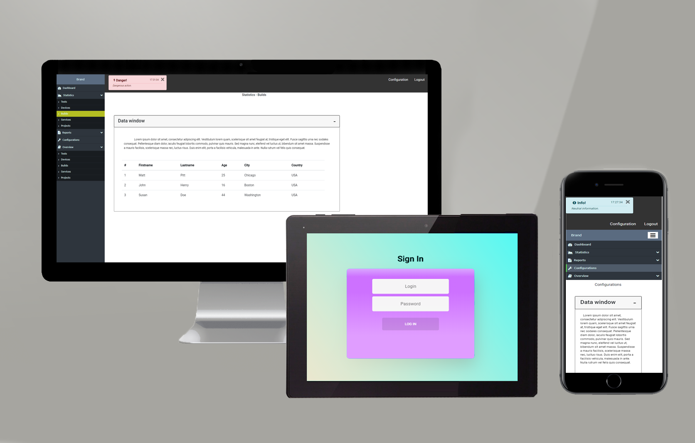

# Angular validation Login-ASP.NET-Core
> Validated by backend on: http://localhost:5000/Login - if you are not able to do it you can just type http://localhost:4200/dashboard (or if you are using github pages to view the site: https://drozdzyk667.github.io/AngularLogin-ASP.NET-Core/dashboard) and you will move to the next section after login validation.

## Screenshots

## Technologies
* HTML 5
* CSS 3
* Typescript
* Angular
* Bootstrap 4
* some Photoshop skills

## Setup / View
There are 2 easy ways to view my project:
* 1. Download ZIP package, unpack it somewhere on your PC and doubleclick on index.html file.
* 2. Use [**GitHub Pages**](https://drozdzyk667.github.io/portfolio_main/).
* 3. Use [**GitHub Pages**](https://drozdzyk667.github.io/AngularLogin-ASP.NET-Core/login).

## Contact
Created by [@drozdzyk92@gmail.com] - feel free to contact me!
